# Building a Scratch Everywhere App (Bundled with Your Scratch Project)

> **Last updated:** October 29th, 2025 (during Beta Build 27)  
> **created/edited by:** Br0tcraft
> **Please read this guide carefully at least once before starting.**  
> Understanding the full process first will save you time and avoid most common mistakes.  

If you run into issues, or if you find errors in this tutorial, please reach out to us on our Discord server  https://discord.com/invite/Y2gf5vZHpJ

---

## Introduction

This guide will show you how to **bundle your Scratch project** into a **standalone app** using **Scratch Everywhere (SE)**.  
Once built, your project will behave like a native app on supported platforms such as **3DS, Wii U, GameCube, PS4, Vita**, and more!

To make things easier and avoid installing tons of dependencies manually, we’ll use **Docker**  
think of it as a small, isolated Linux system that automatically sets everything up for you.

---

## What You’ll Need

- A working **Docker installation**  
- The **Scratch Everywhere** source code (from GitHub)  
- Your **Scratch project (.sb3)**  
- A bit of patience, compiling can take several minutes

---

## Step 1: Install Docker

1. Go to [https://docker.com](https://docker.com)
2. Click **“Download Docker Desktop”**
   
3. Choose your operating system.
   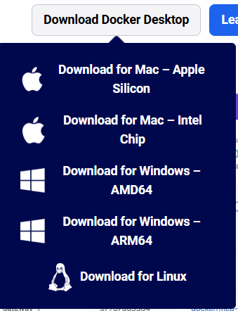
4. On Windows, make sure you select the correct installer for your CPU:
   - **ARM / x64** → use the ARM installer  
   - **AMD64 / x86** → use the AMD64 installer  
5. Run the installer and follow the on-screen instructions.  
6. Once installed, **launch Docker Desktop** to make sure it’s running.

---

## Step 2: Download Scratch Everywhere

1. Visit the official Scratch Everywhere repository:  
	[https://github.com/ScratchEverywhere/ScratchEverywhere](https://github.com/ScratchEverywhere/ScratchEverywhere)
2. Click the green **“<> Code”** button.  
   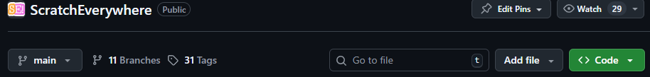
3. Choose **“Download ZIP”**  
   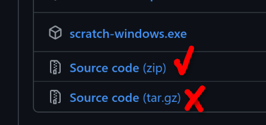
4. Extract this ZIP to a convenient location, for example, near your Scratch project.  
   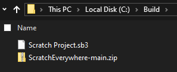

---

## Step 3: Prepare Your Scratch Project

1. Rename your Scratch project’s file extension from `.sb3` → `.zip`  
   Example:  Scratch Project.sb3 → Scratch Project.zip
2. Right-click both ZIP files (the Scratch Everywhere one and your project) and select **“Extract All...”**  

3. You should now have extracted folders that look something like this:  
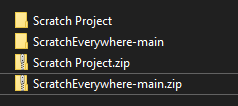
4. You can delete the original `.zip` files, we don’t need them anymore.

---

## Step 4: Set Up the Project Folder Structure

1. Open the folder: ScratchEverywhere-main/ScratchEverywhere/
2. Inside, create a **new folder** named `romfs`  
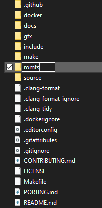
3. Copy your extracted Scratch project folder into `romfs`
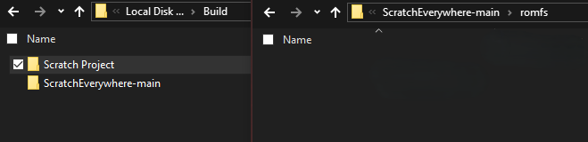
4. Rename your project folder to **`project`** (all lowercase!)  

Your structure should now look like this:

ScratchEverywhere-main/
└── ScratchEverywhere/
├── romfs/
│ └── project/
├── gfx/
├── make/
├── docker/
└── ...

---

## Step 5: Customize Icons and Graphics

Inside the `gfx` folder, you’ll find all the **platform-specific icons and graphics**.  
For example, the `icon.png` file is used as the app icon on consoles like the 3DS.

- You can **replace** these images with your own graphics.  
- ⚠️ **Do not change the file sizes, names, or extensions.**  
  The images must keep their **exact dimensions** and **same filenames** (e.g. `icon.png`).

To modify banners or special icons, open the subfolder with the name of your target console (e.g., `3ds/`, `wiiu/`, etc.).

---

## Step 6: Change App Information (Title, Description, Author)

1. Go into the `make` folder.
   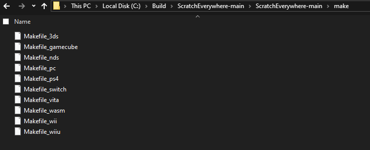
2. Find the `Makefile` that matches your target platform.  
   For example:  
	Makefile_3ds
	Makefile_wiiu
3. Open it in a text editor.  
4. Near the top, you’ll find a section where you can change:
- **App Title**
- **Description**
- **Author Name**

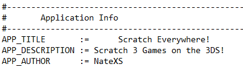

> Tip: It’s nice (but not required) to mention somewhere in your description (or app/game) that it was built using **Scratch Everywhere**.

Save the file after making your changes.

---
a
## Step 7: Build the App Using Docker

1. Make sure **Docker Desktop is running**.  
2. Go back to your main `ScratchEverywhere` folder (the one that contains `romfs`, `gfx`, `make`, etc.).
3. Click in the **address bar** at the top of the window
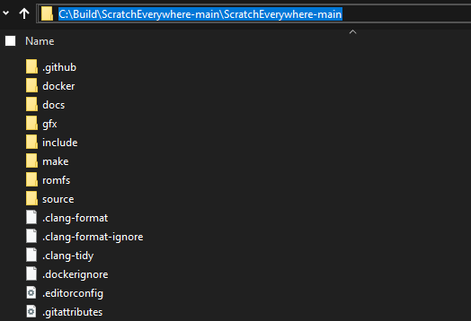
	and type: cmd 
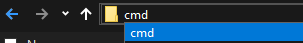
	Then press **Enter**.  
4. A Command Prompt window should open in the correct directory.  
Verify that the path shown matches your `ScratchEverywhere` folder.
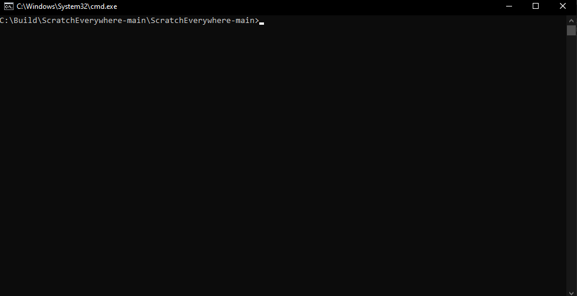
If not, you can manually navigate to it:
cd C:\Path\To\ScratchEverywhere-main\ScratchEverywhere

---

### Build Commands

Use one of the following commands depending on your target platform:

| Platform | Command |
|-----------|----------|
| **3DS** | `docker build -f docker/Dockerfile.3ds --target exporter -o . .` |
| **Wii U** | `docker build -f docker/Dockerfile.wiiu --target exporter -o . .` |
| **Wii** | `docker build -f docker/Dockerfile.wii --target exporter -o . .` |
| **GameCube** | `docker build -f docker/Dockerfile.gamecube --target exporter -o . .` |
| **Nintendo Switch** | `docker build -f docker/Dockerfile.switch --target exporter -o . .` |
| **PS Vita** | `docker build -f docker/Dockerfile.vita --target exporter -o . .` |
| **PS4** | `docker build -f docker/Dockerfile.ps4 --target exporter -o . .` |

The build process may take several minutes, depending on your system.

When finished, it should look something like this:
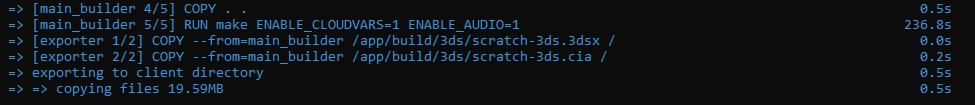

---

## Common Errors & Fixes

| Error | Cause | Solution |
|-------|--------|-----------|
| `ERROR: failed to build: resolve : CreateFile docker: The system cannot find the file specified.` | You’re not in the correct `ScratchEverywhere` folder, or the `docker/` folder is missing or empty. | Check your folder structure or re-download Scratch Everywhere. |
| `ERROR: Error response from daemon: Docker Desktop is manually paused.` | Docker is paused. | Click the 🐋 Docker icon in your system tray → select **Resume** or **Restart**. |
| `ERROR: error during connect: Head "http://%2F%2F.%2Fpipe%2FdockerDesktopLinuxEngine/_ping": ... The system cannot find the file specified.` | Docker isn’t running. | Open Docker Desktop and wait until it’s fully started. |

---

## Step 8: Find Your Compiled Game

After a successful build, your exported files will appear directly in the `ScratchEverywhere` folder.

| Platform | Output Location | File Types |
|-----------|----------------|-------------|
| **3DS** | Main folder | `.3dsx` and `.cia` |
| **Wii U** | `scratch-wiiu` folder | `.rpx` and `.wuhb` |
| **Other platforms** | Typically in their respective subfolders | Various |

You can now copy these files to your console and install or launch them like any other homebrew app!

---

## Final Notes

Congratulations, you’ve successfully built your own **standalone Scratch app** using Scratch Everywhere!

If something doesn’t work:
- Double-check folder names and paths (especially lowercase `project`)
- Make sure Docker is running and not paused
- Re-download the latest version of Scratch Everywhere

And don’t hesitate to share your results or ask for help in our **Discord server**  
we love seeing new projects from the community!