# Building a Scratch Everywhere App (Bundled with Your Scratch Project)

> - **Last updated:** April 25, 2026 for Beta Version whateveritendsupbeing
> - **Created/edited by:** **Br0tcraft**, Dogo6647, Starlii10

> [!WARNING]
> **Please read this guide carefully at least once before starting.**
> Understanding the full process first will save you time and avoid most common
> mistakes.

If you run into issues, or if you find errors in this tutorial, please reach out
to us on our Discord server https://discord.com/invite/Y2gf5vZHpJ

## Introduction

This guide will show you how to **bundle your Scratch project** into a
**standalone app** using **Scratch Everywhere (SE!)**.\
Once built, your project will behave like a native app on supported platforms
such as **3DS, Wii U, GameCube, PS4, Vita**, and more!

To make things easier and avoid installing tons of dependencies manually, we’ll
use **Docker**. Think of it as a small, isolated Linux system that automatically
sets everything up for you.

## What You’ll Need

- A working **Docker installation**
- The **Scratch Everywhere** source code (from GitHub)
- Your **Scratch project (.sb3)**
- A bit of patience. Compiling can take several minutes.

## Step 1: Install Docker

There are two main methods of installing Docker: **Docker Desktop** and the
standalone Docker engine, known as Docker CE. This guide will use Docker Desktop
on Windows and macOS, and Docker CE on Linux.

### Docker Desktop (Windows/macOS)

1. Visit the [Docker website](https://docker.com)
2. Click "Download Docker Desktop"


3. Choose your operating system.

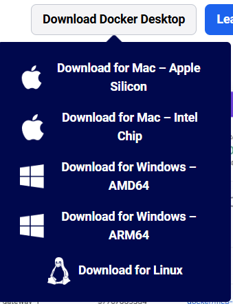

> [!NOTE]
> Make sure to select the correct installer for your CPU:
>
> - ARM / aarch64 → use the **ARM** installer
> - amd64 / x86 → use the **amd64** installer

4. Download the installer, run it, and follow the on-screen instructions.
5. Once installed, **launch Docker Desktop** to make sure it's running.

### Docker CE (Linux)

Follow the instructions found in the
[Docker documentation](https://docs.docker.com/engine/install/) on how to
install Docker CE for your Linux distribution.

## Step 2: Download Scratch Everywhere!

1. Visit the official Scratch Everywhere repository:\
   [https://github.com/ScratchEverywhere/ScratchEverywhere](https://github.com/ScratchEverywhere/ScratchEverywhere)
2. Click the green **“<> Code”** button.\
   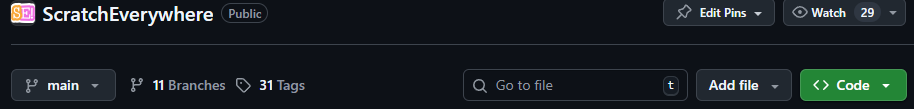
3. Choose **“Download ZIP”**\
   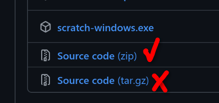
4. Extract this ZIP to a convenient location, for example, near your Scratch
   project.\
   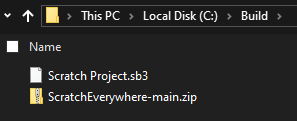

## Step 3: Prepare Your Scratch Project

1. Rename your Scratch project’s file extension from `.sb3` → `.zip`\
   Example: Scratch Project.sb3 → Scratch Project.zip
2. Right-click both ZIP files (the Scratch Everywhere one and your project) and
   select **“Extract All...”**\
   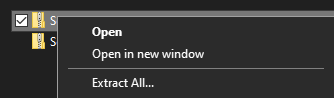
3. You should now have extracted folders that look something like this:\
   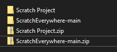
4. You can delete the original `.zip` files, we don’t need them anymore.

## Step 4: Set Up the Project Folder Structure

1. Open the folder: ScratchEverywhere-main/ScratchEverywhere/
2. Inside, create a **new folder** named `romfs`\
   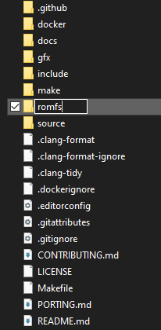
3. Copy your extracted Scratch project folder into `romfs`
   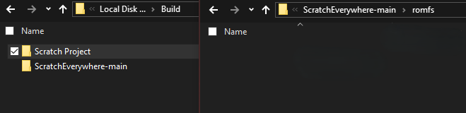
4. Rename your project folder to **`project`** (all lowercase!)\
   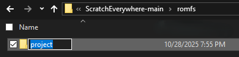

Your structure should now look like this:

```
ScratchEverywhere-main/
└── ScratchEverywhere/
   ├── romfs/
   │   └── project/
   ├── gfx/
   ├── make/
   ├── docker/
   └── ...
```

---

## Step 5: Customize Icons and Graphics

Inside the `gfx` folder, you’ll find all the **platform-specific icons and
graphics**.\
For example, the `icon.png` file is used as the app icon on consoles like the
3DS.

- You can **replace** these images with your own graphics.
- ⚠️ **Do not change the file sizes, names, or extensions.**\
  The images must keep their **exact dimensions** and **same filenames** (e.g.
  `icon.png`).
- [GIMP](https://gimp.org) is great for these kinds of things, but you can use
  any image editing software you want.
- For the Vita's images, you will neet to get
  [`pngquant`](https://pngquant.org/) and run:
  ```
  cd /path/to/gfx/vita/
  pngquant --posterize 4 path/to/your_image.png same/path/output.png
  ```
  in the command prompt (Win + R then type "cmd" and press enter on Windows,
  Find "Terminal" in the home menu on everything else), then rename output.png
  to the original image's name. When asked to overwrite it, click "Yes".
  <br>**You can ignore this step for all other platforms.**

To modify banners or special icons, open the subfolder with the name of your
target console (e.g., `3ds/`, `wiiu/`, etc.).

## Step 6: Change App Information (Title, Description, Author)

1. Go back to your main `ScratchEverywhere-main` folder (the one that contains
   `romfs`, `gfx`, `make`, etc.).
2. Find the file named `CMakeLists.txt`. Open it in a text editor.
3. Scroll down until you see these lines:

```
set(SE_APP_NAME "Scratch Everywhere!" CACHE STRING "Name of the outputed app.")
set(SE_APP_DESCRIPTION "Play Scratch games on anything!" CACHE STRING "Description of the outputed app.")
set(SE_APP_AUTHOR "Scratch Everywhere! Contributors" CACHE STRING "Author of the outputed app.")
```

4. Modify these values to fit your project.
5. Save and close the file.

<!-- deno-fmt-ignore -->
> [!NOTE] Tip
> It’s nice (but not required) to mention somewhere in your
> description (or app/game) that it was built using **Scratch Everywhere!**.

## Step 7: Build the App Using Docker

1. Make sure **Docker Desktop is running**.
2. Go back to your main `ScratchEverywhere-main` folder (the one that contains
   `romfs`, `gfx`, `make`, etc.). Note the directory shown in the address bar.
3. Open a terminal (Command Prompt on Windows) and navigate to the folder you
   noted down:

```
cd /path/to/ScratchEverywhere-main
```

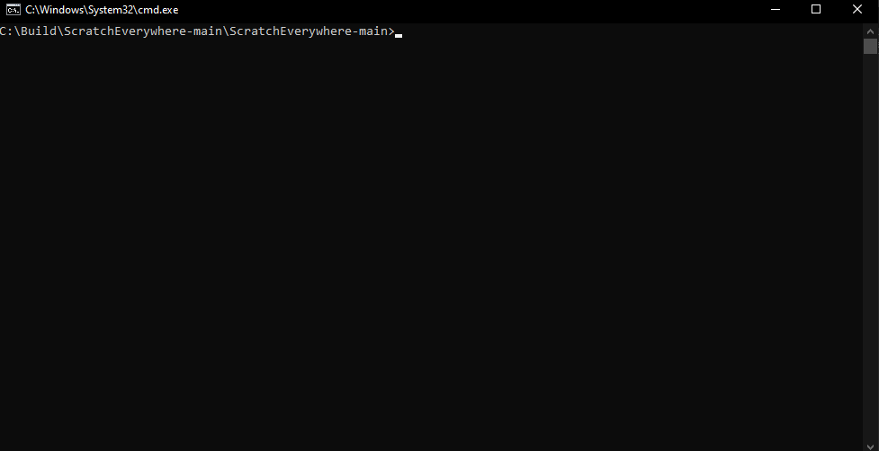

### Build Commands

To build the project, use this command:

```
docker build -f docker/Dockerfile.{platform} --target exporter -o . .
```

Replace `{platform}` with the platform you would like to build for.

The build process may take several minutes, depending on your system.

When finished, it should look something like this: 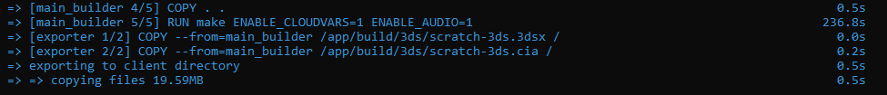

### Common Errors & Fixes

| Error                                                                                                                                        | Cause                                                                                              | Solution                                                                         |
| -------------------------------------------------------------------------------------------------------------------------------------------- | -------------------------------------------------------------------------------------------------- | -------------------------------------------------------------------------------- |
| `ERROR: failed to build: resolve : CreateFile docker: The system cannot find the file specified.`                                            | You’re not in the correct `ScratchEverywhere` folder, or the `docker/` folder is missing or empty. | Check your folder structure or re-download Scratch Everywhere.                   |
| `ERROR: Error response from daemon: Docker Desktop is manually paused.`                                                                      | Docker is paused.                                                                                  | Click the 🐋 Docker icon in your system tray → select **Resume** or **Restart**. |
| `ERROR: error during connect: Head "http://%2F%2F.%2Fpipe%2FdockerDesktopLinuxEngine/_ping": ... The system cannot find the file specified.` | Docker isn’t running.                                                                              | Open Docker Desktop and wait until it’s fully started.                           |

## Step 8: Find Your Compiled Game

After a successful build, your exported files will appear directly in the
`ScratchEverywhere` folder.

| Platform         | File Types                                    |
| ---------------- | --------------------------------------------- |
| **3DS**          | `.3dsx` and `.cia`                            |
| **Wii U**        | `.rpx` and `.wuhb`                            |
| **Vita**         | `.vpk`                                        |
| **PS4**          | `.pkg`                                        |
| **Switch**       | `.nro`                                        |
| **PSP**          | `.zip`                                        |
| **DS**           | `.nds`                                        |
| **GameCube/Wii** | `.dol`                                        |
| **webOS**        | `.ipk`                                        |
| **PC**           | `scratch-*` (Unix/macOS) <br>`.exe` (Windows) |

You can now copy these files to your console and install or launch them like any
other homebrew app!

## Final Notes

Congratulations, you’ve successfully built your own **standalone Scratch app**
using Scratch Everywhere!

If something doesn’t work:

- Double-check folder names and paths
- Make sure Docker is running and not paused
- Re-download the latest version of Scratch Everywhere!

And don’t hesitate to share your results or ask for help in our **Discord
server**.\
We love seeing new projects from the community!
